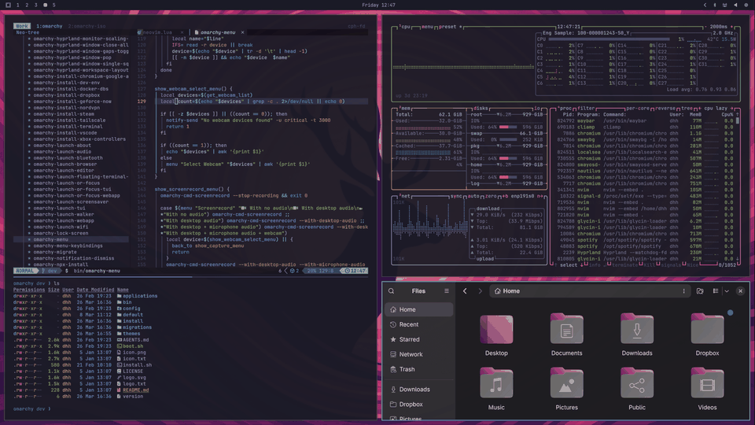

<h1 align="center">Agent0S</h1>

  <strong>A beautiful, keyboard-driven Linux desktop built for working alongside AI agents.</strong>

  
  
  
  
  

  <a href="manual/02-getting-started.md">Getting Started</a> ·
  <a href="manual/01-welcome-to-agent0s.md">Manual</a> ·
  <a href="agents/skills">Agent Skills</a> ·
  <a href="https://github.com/eli-labz/AgentOS/issues">Report a Bug</a>

---

## Why Agent0S?

Agent0S is a fork of [Omarchy](https://github.com/omacom/omarchy) that keeps everything that makes it a joy to use and adds a layer designed for agentic workflows: a system your AI coding agents can understand, modify and verify.

- **Agent-ready from the first boot.** `AGENTS.md`, `CLAUDE.md` and a library of [agent skills](agents/skills) teach AI agents how the system is built, how to write migrations and install scripts, and how to verify their own changes.
- **Beautiful out of the box.** Curated themes, fonts and backgrounds, with a tiling Hyprland desktop that looks good without hours of ricing.
- **Keyboard first.** Every core action has a hotkey. See the [hotkey reference](manual/07-hotkeys.md).
- **Developer toolkit included.** Terminal, Neovim, shell tools, TUIs and dev tooling configured and ready to go.
- **Yours to reshape.** Plain dotfiles, a CLI for common tasks, and a guide to [making your own theme](manual/43-making-your-own-theme.md).

  
   
  A few of the 22 built-in themes. See <a href="manual/06-themes.md">Themes</a> to switch or <a href="manual/43-making-your-own-theme.md">make your own</a>.

## Quick start

Agent0S doesn't have its own ISO yet, so installs currently start from the upstream [Omarchy ISO](https://omarchy.org/). Follow the [Getting Started guide](manual/02-getting-started.md) for the full walkthrough. Coming from macOS or Windows? Read [Coming From Mac or Windows](manual/03-coming-from-mac-or-windows.md) first.

## For AI agents

| File | What it gives an agent |
| --- | --- |
| [`AGENTS.md`](AGENTS.md) | Project conventions and how the repo fits together |
| [`CLAUDE.md`](CLAUDE.md) | Guidance for Claude-based coding agents |
| [`agents/skills/`](agents/skills) | Task playbooks: acceptance tests, install scripts, migrations, shell dev, visual verification and more |

## The Manual

The full manual lives in [`manual/`](manual/).

<strong>The Basics</strong>

- [Welcome to Agent0S](manual/01-welcome-to-agent0s.md)
- [Getting Started](manual/02-getting-started.md)
- [Coming From Mac or Windows](manual/03-coming-from-mac-or-windows.md)
- [Navigation](manual/04-navigation.md)
- [The top bar](manual/05-the-top-bar.md)
- [Themes](manual/06-themes.md)
- [Hotkeys](manual/07-hotkeys.md)
- [Unified Clipboard & History](manual/08-unified-clipboard-history.md)
- [Reminders](manual/09-reminders.md)
- [Notices](manual/10-notices.md)
- [Text Extraction & Dictation](manual/11-text-extraction-dictation.md)
- [Screenshots & Recording](manual/12-screenshots-recording.md)
- [Toggles, idle & screensaver](manual/13-toggles-idle-screensaver.md)
- [Agent0S CLI](manual/14-agent0s-cli.md)

<strong>The Applications</strong>

- [Terminal](manual/15-terminal.md)
- [Neovim](manual/16-neovim.md)
- [AI](manual/17-ai.md)
- [Development Tools](manual/18-development-tools.md)
- [Shell Tools](manual/19-shell-tools.md)
- [Shell Functions](manual/20-shell-functions.md)
- [TUIs](manual/21-tuis.md)
- [GUIs](manual/22-guis.md)
- [Browsers](manual/23-browsers.md)
- [Commercial apps/services](manual/24-commercial-apps-services.md)
- [Web Apps](manual/25-web-apps.md)
- [Gaming](manual/26-gaming.md)
- [Filling out PDFs](manual/27-filling-out-pdfs.md)
- [Windows VM](manual/28-windows-vm.md)
- [Other Packages](manual/29-other-packages.md)

<strong>Configuration</strong>

- [Updates](manual/30-updates.md)
- [Dotfiles](manual/31-dotfiles.md)
- [Shell plugins](manual/32-shell-plugins.md)
- [Monitors](manual/33-monitors.md)
- [Keyboard, Mouse, Trackpad](manual/34-keyboard-mouse-trackpad.md)
- [Networking](manual/35-networking.md)
- [System sleep](manual/36-system-sleep.md)
- [Hardware authentication](manual/37-hardware-authentication.md)
- [Fonts](manual/38-fonts.md)
- [Backgrounds](manual/39-backgrounds.md)
- [Prompt](manual/40-prompt.md)
- [Branding](manual/41-branding.md)
- [Common tweaks](manual/42-common-tweaks.md)
- [Making your own theme](manual/43-making-your-own-theme.md)

<strong>The Rest</strong>

- [Mac support](manual/44-mac-support.md)
- [Troubleshooting](manual/45-troubleshooting.md)
- [FAQ](manual/46-faq.md)
- [System snapshots](manual/47-system-snapshots.md)
- [Security](manual/48-security.md)
- [Agent0S on...](manual/49-agent0s-on.md)
- [Dual Boot Install](manual/50-dual-boot-install.md)
- [Unattended Installs](manual/51-unattended-installs.md)

## Contributing

Issues and pull requests are welcome. If you're using an AI agent to contribute, point it at [`AGENTS.md`](AGENTS.md) and the [agent skills](agents/skills) first.

If Agent0S is useful to you, a ⭐ helps other people find it.

## Credits

Agent0S is built on [Omarchy](https://github.com/omacom/omarchy), created by David Heinemeier Hansson and its contributors. Agent0S is an independent fork and is not affiliated with or endorsed by the Omarchy project.

## License

Released under the [MIT License](LICENSE).
